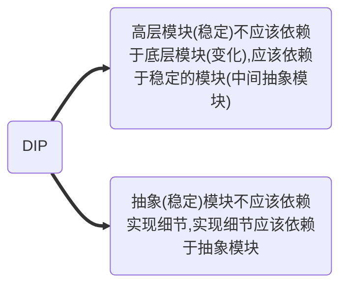

# 面向对象设计原则

##  设计原则比设计原则更重要

## 依赖倒置原则(DIP)


```mermaid
graph LR

B(DIP)==>C("高层模块(稳定)不应该依赖于底层模块(变化),应该依赖于稳定的模块(中间抽象模块)")
B==>D("抽象(稳定)模块不应该依赖实现细节,实现细节应该依赖于抽象模块")


```
### 实例


graph TD

E(a)==>F(ddd)
```


## 开放封闭原则 (OCP)

​```mermaid
graph LR

```

